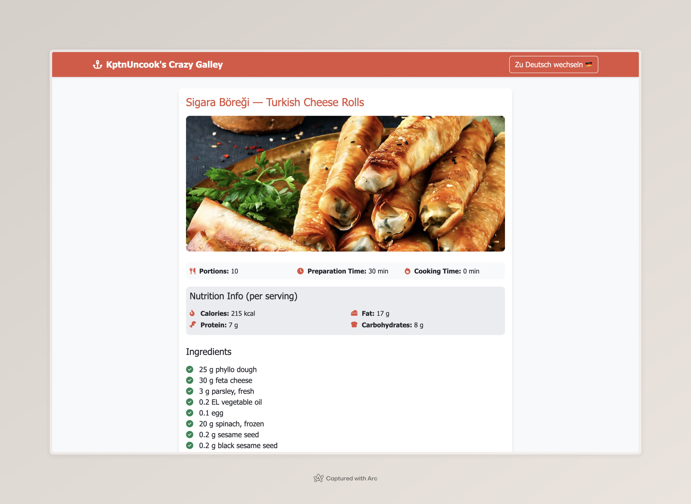

# KptnUncook 

This project is a simple web application that allows sharing and viewing recipes from [KptnCook](https://www.kptncook.com/). It provides an easy way to fetch and display recipe details using short links.

> 🎉 **Tip:** You can now use the site to directly import recipes from KptnCook into [Crouton](https://crouton.app/)! \
> Using [this](https://www.icloud.com/shortcuts/4e3fff62cf20494aa2d17280dbc64af3) shortcut, you can just hit "Share" on any KptnCook recipe and select "Cook2Crouton" to add it with all the available information. \
> A big thanks to [Devin](https://mastodon.social/@JustMeDevin) for providing the necessary info to make this happen! 🙌

## Features

- Fetch recipes using KptnCook short links
- Display recipe details including ingredients, instructions, and nutritional information
- Multilingual support (English and German)
- Copy recipe links and markdown format
- Import recipes into Crouton

>[!WARNING]
>This project is not affiliated with KptnCook.com and is a quick, hacked together project done in a few hours. 
>Use at your own risk and don't judge the code quality too harshly. ;-D

## Setup & Usage

This project written to be deployed to [Netlify](https://www.netlify.com/).

Remember to set `KPTNCOOK_API_KEY` as an environment variable in Netlify and setup `npm run build` as a build command.

## Project Structure

- `index.html`: Main HTML file
- `script.js`: Client-side JavaScript for handling user interactions
- `localization.js`: Translations and language switching functionality
- `functions/getRecipe.js`: Netlify function for fetching recipe data from KptnCook API, providing a pre-rendered HTML response.

## API Integration

The project uses the KptnCook API to fetch recipe data. It is possible thanks to the great reverse engineering by [@gloriousDan](https://github.com/gloriousDan/kptncook-api-reverse-engineering)!
