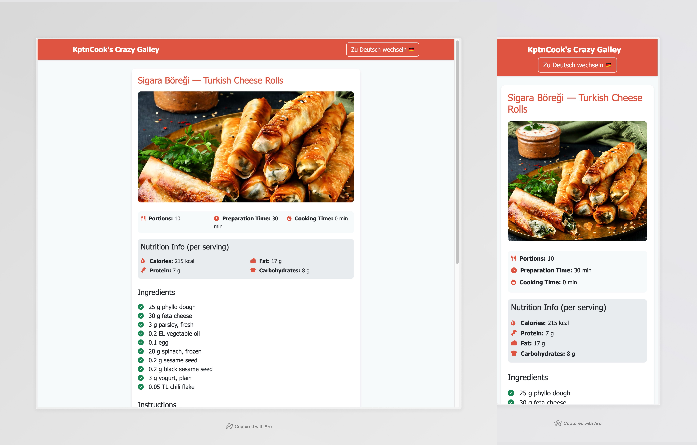

# KptnUncook 

[](https://app.netlify.com/sites/kptncook/deploys)

This project is a simple web application that allows sharing and viewing recipes from [KptnCook](https://www.kptncook.com/). It provides an easy way to fetch and display recipe details using short links.



## Features

- Fetch recipes using KptnCook short links
- Display recipe details including ingredients, instructions, and nutritional information
- Multilingual support (English and German)
- Copy recipe links and markdown format

## Setup

1. Clone the repository
2. Install dependencies:
   ```
   npm install
   ```
3. Set up your environment variables:
   - Create a `.env` file in the root directory
   - Add your KptnCook API key:
     ```
     KPTNCOOK_API_KEY=your_api_key_here
     ```

## Usage

1. Start the development server:
   ```
   npm run build
   npm start
   ```
2. Open your browser and navigate to `http://localhost:3000`
3. Enter a KptnCook recipe short link in the input field and click "Get Recipe"

## Project Structure

- `index.html`: Main HTML file
- `script.js`: Client-side JavaScript for handling user interactions
- `localization.js`: Translations and language switching functionality
- `functions/getRecipe.js`: Serverless function for fetching recipe data from KptnCook API

## API Integration

The project uses the KptnCook API to fetch recipe data. It is possible thanks to the great reverse engineering by [@gloriousDan](https://github.com/gloriousDan/kptncook-api-reverse-engineering)!
